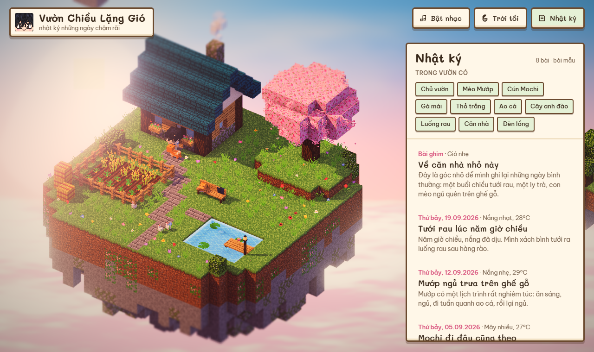
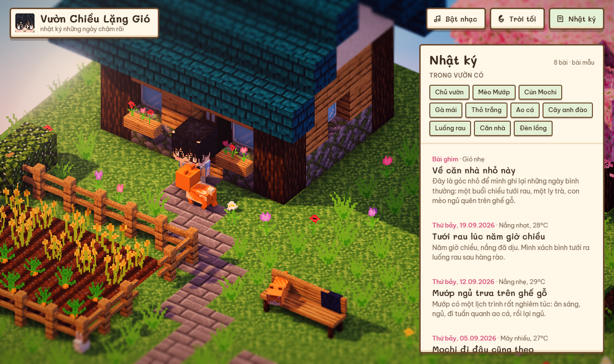
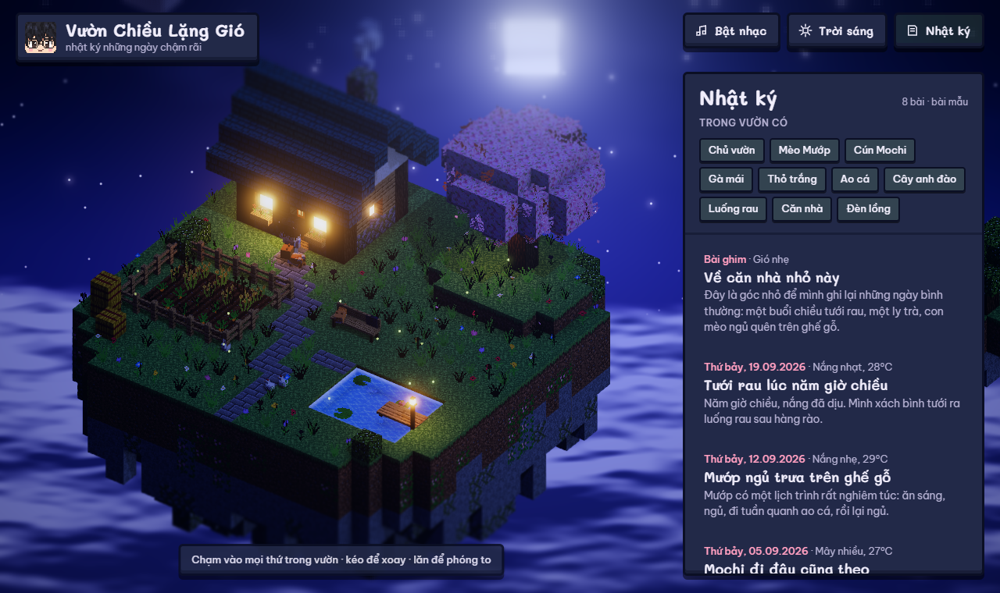

# Vườn Chiều Lặng Gió

Blog đời sống dạng diorama voxel (kiểu Minecraft) chạy trong trình duyệt: một căn nhà gỗ nhỏ trên đảo bay, cây anh đào, luống rau, ao cá, và chủ vườn chibi đi tưới cây cùng mèo Mướp, cún Mochi, gà và thỏ. Bấm vào nhân vật hay đồ vật nào cũng có phản ứng và mở bài nhật ký liên quan.



| Cận cảnh | Ban đêm |
| --- | --- |
|  |  |

## Phim 60 giây

Thư mục [`video/`](video/) chứa phim hoạt hình 60 giây dựng từ chính khu vườn này bằng HyperFrames, nhạc "Sleepy Cat" và âm thanh từ Mixkit: [`video/vuon-chieu-60s.mp4`](video/vuon-chieu-60s.mp4).

## Chạy thử

Mở `vuon-chieu.html` qua một web server tĩnh bất kỳ, ví dụ:

```bash
python -m http.server 8765
```

rồi vào `http://localhost:8765/vuon-chieu.html`.

## Sửa nội dung

- Bài nhật ký nằm trong mảng `POSTS` ở đầu phần script của `vuon-chieu.src.html` (hiện là **bài mẫu**).
- Sau khi sửa, chạy `python build.py` để nhúng texture và tạo lại `vuon-chieu.html`.

## Cách làm

- **3D:** Three.js 0.181. Địa hình ghép khối có ambient occlusion theo đỉnh; nhân vật và thú cưng dựng từ hộp có texture pixel.
- **Shader hậu kỳ:** bầu trời và biển mây vẽ bằng shader, GTAO, bloom, tilt-shift, chỉnh màu; nước lấp lánh bằng shader riêng.
- **Texture:** thiết kế bằng GPT (gpt-image-2) rồi cắt thành pixel 16/32 px bằng `gpt/process.py`. Ảnh gốc: `gpt/concept.png`, `gpt/blocks.png`, `gpt/skins.png`.
- **Âm thanh trên web:** tổng hợp trực tiếp bằng Web Audio, không dùng file nhạc.

Không dùng model AI tạo video hay tạo 3D; ảnh chân dung thật không được gửi lên GPT, nhân vật được mô tả bằng chữ.
